# Prometheus & Grafana

## Quick Starter

```shell
#!/bin/bash

sh quick-starter.sh
```

해당 프로젝트를 실행하기 위해서는 `Docker` 및 `Docker-Compose`가 설치되어 있어야 합니다.

## Prometheus

<div align="center">

 

[Prometheus](https://prometheus.io/)는 엔드포인트를 스크레이프하는 모니터링 및 시계열 데이터베이스입니다. 수집된 데이터를 쿼리, 집계 및 저장하는 기능을 제공합니다. 알림 및 알림 집계에도 사용할 수 있습니다. 

</div>

### 특징

- Grafana를 통한 시각화 지원합니다.
- 많은 시스템을 모니터링할 수 있는 다양한 플러그인을 가지고 있습니다.
- 쿠버네티스의 메인 모니터링 시스템으로 많이 사용됩니다.
- 프로메테우스가 주기적으로 exporter(모니터링 대상 시스템)로부터 Pulling 방식으로 메트릭을 읽어서 수집합니다.

### 주요 기능

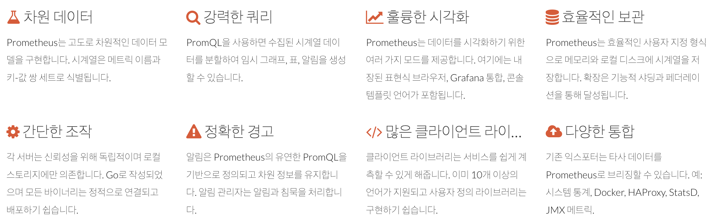

다음과 같은 많은 기능들을 제공하고 있습니다.

### 아키텍처

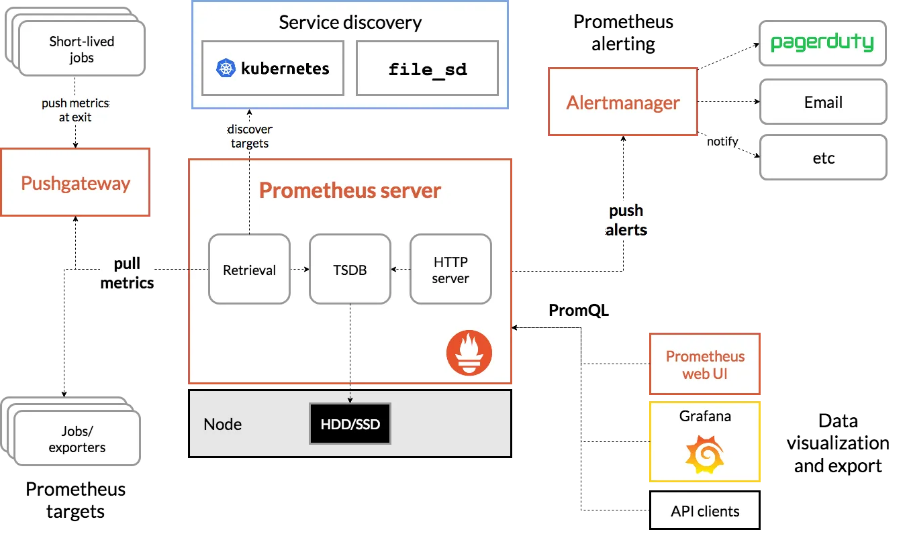

간단하게 설명하자면 아래와 같습니다.

Jobs/exporters 실제로 메트릭을 수집하는 프로스세(서버)라고 보면 됩니다.
이 exporter가 매트릭을 수집하고 HTTP 통신을 통해 매트릭 데이터를 가져갈 수 있게 `/metrics` 라는 HTTP 엔드포인트를 제공합니다.

그러면 Prometheus server가 이 exporter의 엔드포인트로 HTTP GET 요청을 날려 매트릭 정보를 수집(Pull)합니다.
수집한 정보를 Prometheus가 제공하는 간단한 웹 뷰를 통해 조회할 수 있고 그 안에서 테이블 및 그래프 형태로 볼 수 있지만 시각화 도구가 부족해서 이를 직접 사용하지는 않고 Grafana를 이용하여 시각화하고 있습니다.

## Grafana

<div align="center">


Grafana는 멀티플랫폼 오픈 소스 애널리틱스 및 인터랙티브 시각화 웹 애플리케이션이다.

</div>

### 특징

그라파나는 시계열 매트릭 데이터 수집에 강한 모습을 보이는 만큼, 활용하는 부분도 서버리소스의 매트릭 정보나 로그 같은 데이터를 시각화하는 데 많이 사용합니다.
시각화한 그래프에서 특정 수치 이상으로 값이 치솟을 때 알림을 전달받을 수 있는 기능도 제공합니다. 이러한 기능은 인프라 운영 관점에서 굉장히 중요한 기능이라고 할 수 있습니다.
오픈소스 툴킷인 만큼, 일반 사용자들이 만들어놓은 대시보드를 가져와서 사용할 수 있고 내 입맛에 맞게 커스터마이징도 할 수 있습니다.

## 설치

<div align="center>


Docker를 활용해서 Prometheus & Grafana를 설치합니다.

</div>

### prometheus.yml

먼저 스프링서버와 연결하기 위해 환경 설정 파일을 작성해야 합니다.

```yml
global:
  scrape_interval: 15s

scrape_configs:
  - job_name: 'prometheus'
    scrape_interval: 5s
    static_configs:
      - targets: ['127.0.0.1:9090']


  - job_name: 'grafana'
    scrape_interval: 5s
    static_configs:
      - targets: ['grafana:3000']

  - job_name: 'spring-actuator'
    metrics_path: '/actuator/prometheus'
    scrape_interval: 1s
    static_configs:
      - targets: [ '{your ip address}:8080' ]
```

마지막 `targets`는 서버의 IP Address를 작성해주면 됩니다.

> 만약 여러개의 서버라면 다음과 같이 작성하면 됩니다.
>  ```yml
> - job_name: 'spring-actuator'
>   metrics_path: '/actuator/prometheus'
>   scrape_interval: 1s
>   static_configs:
>       - targets: 
>           - '192.168.1.10:8080'
>           - '192.168.1.11:8080'
>```

### docker-compose.yml

```yml
services:
  prometheus:
    image: prom/prometheus
    ports:
      - "9090:9090"
    volumes:
      - ./prometheus.yml:/etc/prometheus/prometheus.yml
    command:
      - '--config.file=/etc/prometheus/prometheus.yml'

  grafana:
    image: grafana/grafana
    ports:
      - "3000:3000"
```

> 위에서 작성한 설정을 사용하기 위해서 볼륨으로 설정 파일을 추가한 뒤 해당 설정 파일을 가지고 구동을 시작합니다.

이후 `docker-compose up -d`를 터미널에 입력하면 동작하는 것을 확인할 수 있습니다.

> Spring Boot와 연동된 서버를 확인하고 싶다면 `docker-compose -f docker-compose.spring.yml up -d`를 터미널에 입력해주시면 됩니다.

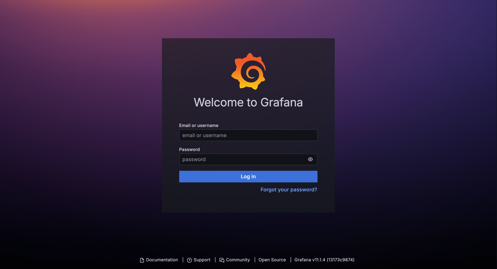

## Spring Boot

이번에는 Spring Boot에서 설정을 해보도록 하겠습니다.

### Dependencies

먼저 두개의 의존성이 필요하기 때문에 추가하도록 합니다.
```groovy
dependencies {
    implementation 'org.springframework.boot:spring-boot-starter-actuator'
    runtimeOnly 'io.micrometer:micrometer-registry-prometheus'
}
```

### Application.yml

이후 환경 설정을 추가하도록합니다.

```yaml
management:
  endpoints:
    web:
      exposure:
        include: prometheus
```

정상적으로 동작하는지 확인하기 위해 `{SPRING_SERVER_IP}:/actuator/prometheus` 에서 확인할 수 있습니다.

혹은 `{PROMETHEUS_SERVER_IP}/targets` 에서도 가능합니다.

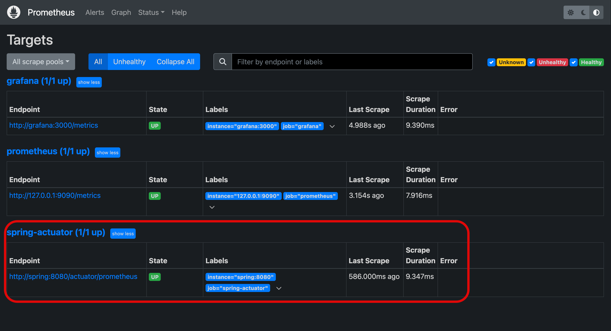

## Grafana 설정

이제는 그라파나에서 대시보드를 설정해보도록 하겠습니다.

### Data Sources 설정

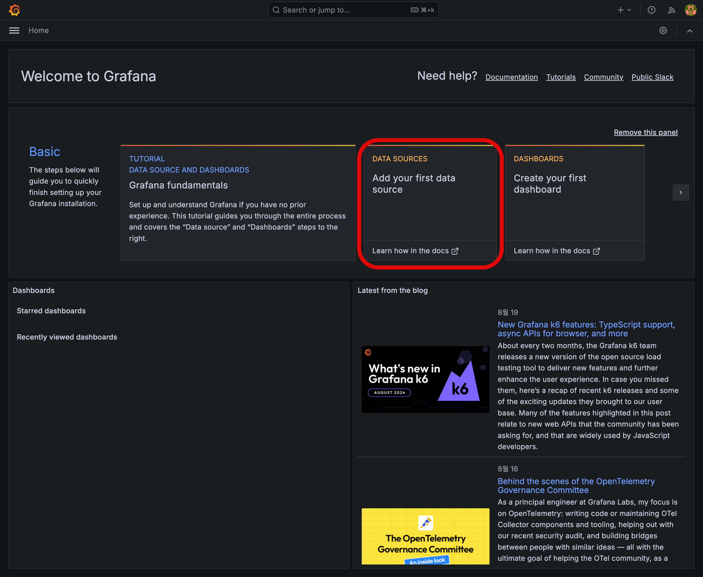
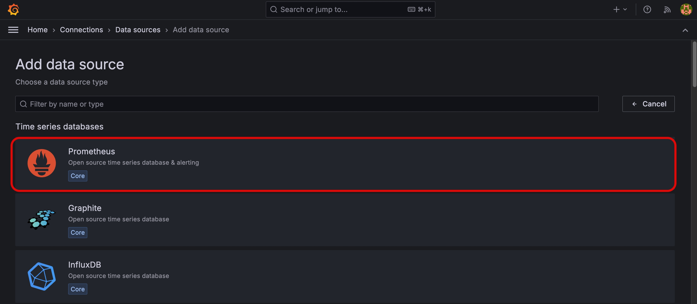

프로메테우스를 사용하기 때문에 해당 데이터 소스를 선택합니다.

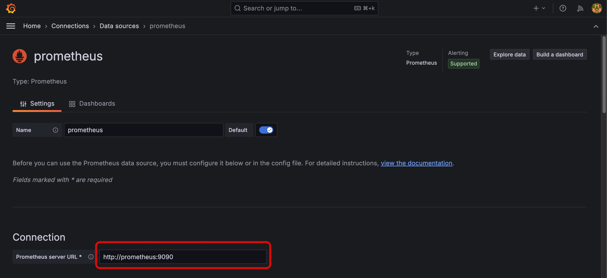

프로메테우스의 주소를 입력해줍니다.

> 저는 Docker-Compose로 되어있기 때문에 서비스명으로 작성하였습니다.

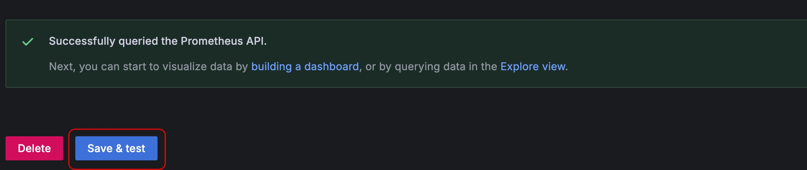

`Save & test`시 성공하면 위와 같은 화면이 나옵니다.


### Grafana 대시보드 설정

외부에서 가져와서 사용하는 것이 편하기 때문에 [Grafana - Dashboard](https://grafana.com/grafana/dashboards/)에서 하나를 찾은 뒤 적용해보도록 하겠습니다.
> 적용한 파일은 `14430_rev1.json` 입니다.

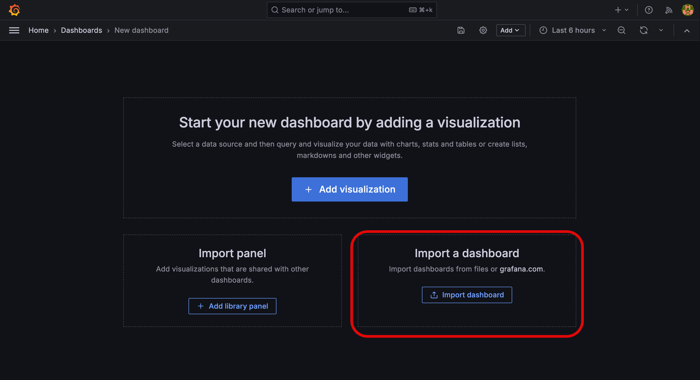

외부에서 다운 받은 대시보드를 가져오기 위해 `Import dashboard`를 선택합니다.

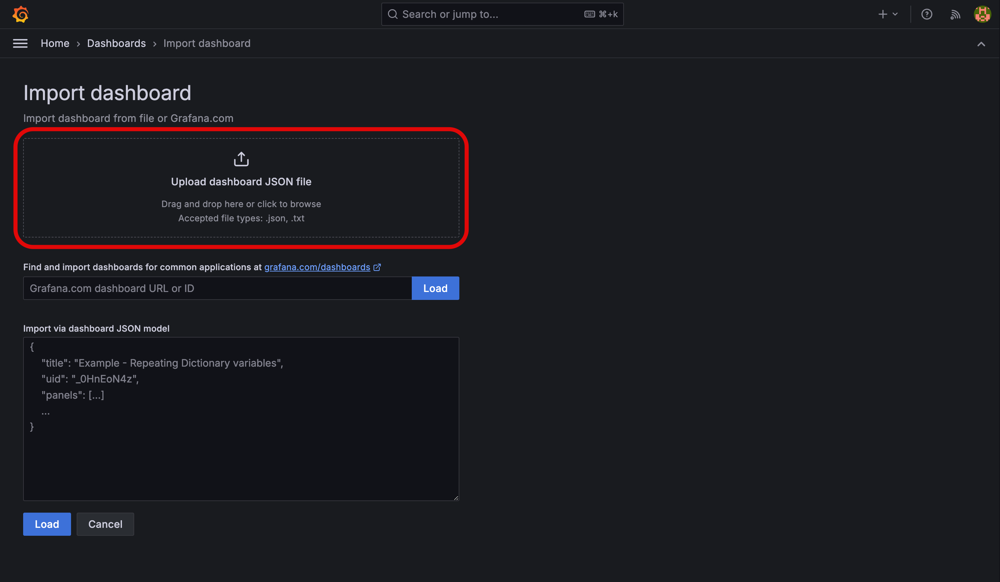

이후 다운 받은 `JSON` 파일을 업로드하여 설정을 가져옵니다.

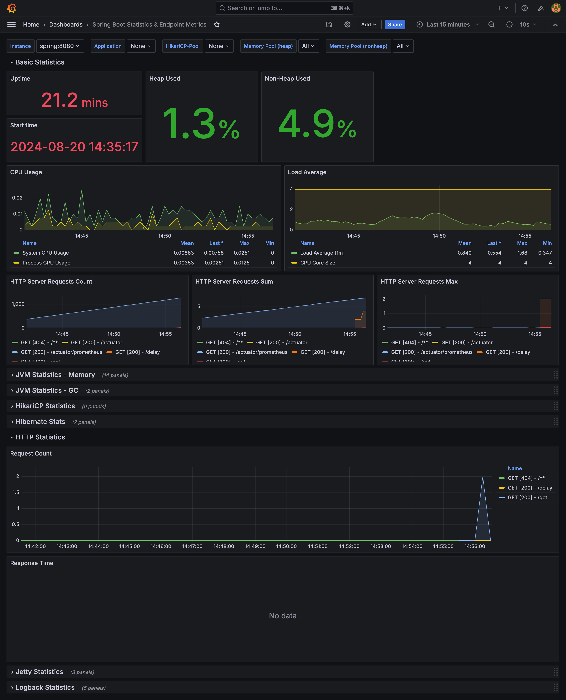

이후 해당 대시보드로 들어가게 된다면 서버의 상태를 확인할 수 있습니다.

## 정리

그라파나와 프로메테우스를 활용해 서버의 정보를 확인하면 문제가 발생했을 시 빠르게 대처가 가능하다는 장점이 있습니다.

또한 대시보드를 프로젝트의 성격에 맞춰서 설정하여 원하는 정보만 빠르게 볼 수 있다는 장점도 있습니다. 요즘은 Loki까지 추가하여 구성하는 것이 대세로 자리잡고 있으며 추후 해당 내용도 작성해보도록 하겠습니다.

## Ref

- [AWS - Prometheus](https://docs.aws.amazon.com/ko_kr/eks/latest/userguide/prometheus.html)
- [finda 기술블로그 - Prometheus란?](https://medium.com/finda-tech/prometheus%EB%9E%80-cf52c9a8785f)
- [finda 기술블로그 - Grafana란?](https://medium.com/finda-tech/grafana란-f3c7c1551c38)
- [benlee73 - Prometheus & Grafana 정리](https://benlee73.tistory.com/60)
- [Grafana Dashboard - Spring Boot Statistics & Endpoint Metrics](https://grafana.com/grafana/dashboards/14430-spring-boot-statistics-endpoint-metrics/)